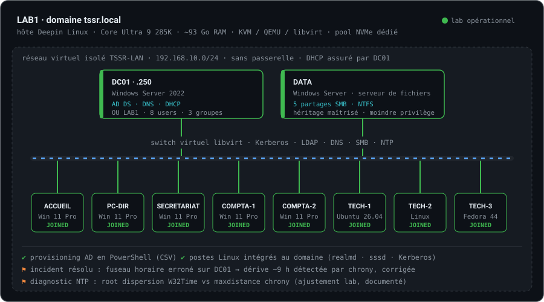

<p align="center">
  
</p>

<p align="center">
  <a href="https://www.linkedin.com/in/milourou-coulibaly"></a>
  <a href="https://www.coulibaly.tech"></a>
  <a href="mailto:milourou@coulibaly.tech"></a>
</p>
<p align="center">
  
</p>

---

## `$ cat ~/about.md`

> **Passionné d'informatique depuis 2010**, j'ai appris sur le terrain avant de l'apprendre en formation : montage et dépannage de postes, support utilisateurs, réseau d'un cybercafé. Titulaire d'une licence en audiovisuel et communication, j'ai choisi en 2026 de faire de l'infrastructure mon métier.
>
> Je prépare le titre **Administrateur d'Infrastructures Sécurisées** (AIS, RNCP 37680, niveau 6) chez O'clock. Curieux de nature, je touche à presque tout : je monte des labs, je teste, je provoque des pannes pour comprendre comment les résoudre, et je documente ce que j'apprends.

<table>
<tr>
<td width="50%" valign="top">

**🎯 Ce que je vise**
- Administrer et **sécuriser** des systèmes d'information hybrides, sur site et dans le cloud
- Garantir **disponibilité, performance et continuité** de service
- Évoluer vers le **SOC**, la détection et la réponse à incident

</td>
<td width="50%" valign="top">

**🧠 Ce que l'audiovisuel m'a laissé**
- Le **sens du détail** et du travail bien fini
- **Documenter et expliquer** clairement, pour un utilisateur comme pour un DSI
- Garder son calme **sous la pression d'un direct** : utile pendant un incident

</td>
</tr>
</table>

---

## `$ tree ~/competences`

| | Domaine | Compétences |
|:-:|---|---|
| 🖥️ | **Poste de travail & matériel** | Architecture d'un ordinateur, composants, connectique · BIOS / UEFI · MBR / GPT · installation et dépannage Windows et Linux |
| 🎧 | **Centre de services** | Diagnostic et résolution d'incidents · prise en main à distance · procédures · bonnes pratiques **ITIL** · ticketing **GLPI** |
| 🌐 | **Réseaux** | Modèles **OSI** et **TCP/IP** · Ethernet, MAC, ARP · adressage IP et sous-réseaux · DHCP · commutation et **VLAN** · routage, **NAT** · switch de niveau 3 · Wi-Fi · **Cisco IOS** · Telnet / SSH |
| 🪟 | **Systèmes Windows** | Windows Server 2022 · **Active Directory** (OU, utilisateurs, groupes) · DNS · DHCP · serveur de fichiers · partages SMB · permissions **NTFS** |
| 🐧 | **Systèmes Linux** | Ligne de commande · utilisateurs, groupes, permissions · intégration à un domaine AD (**realmd · sssd · Kerberos**) · synchronisation horaire (**chrony**) |
| 🧩 | **Virtualisation** | **KVM / QEMU / libvirt** · réseaux virtuels isolés · UEFI Secure Boot · conception d'un lab multi-VM |
| ⚙️ | **Automatisation** | **PowerShell** (provisioning AD depuis CSV) · Bash · Git |
| 🔐 | **Sécurité** | Bonnes pratiques et hygiène informatique · principe du moindre privilège · séparation lab / production |

<details open>
<summary><b>🧰 Stack technique</b></summary>
<br>

**Systèmes**<br>


**Réseau**<br>


**Virtualisation**<br>


**Support & ITSM**<br>


**Scripting & outils**<br>


</details>

---

## `$ virsh list --all` · Homelab LAB1

Une **PME simulée** de bout en bout : un domaine, des services, des utilisateurs, des droits, des postes Windows et Linux, et les incidents qui vont avec. Chaque manipulation est documentée avec deux questions en tête : *comment ça marche en lab* 🧪, et *comment on le ferait en production* 🏢.

<p align="center">
  
</p>

> 📝 L'histoire complète du lab est racontée sur LinkedIn : [**Dès le début de ma formation AIS, j'ai construit mon lab**](https://www.linkedin.com/pulse/d%C3%A8s-le-d%C3%A9but-de-ma-formation-ais-jai-construit-mon-lab-coulibaly-t5ofe/)

---

## `$ ls ~/projets`

| | Projet | Domaine | Description |
|:-:|---|---|---|
| 🧪 | **LAB1** | Infrastructure | Domaine `tssr.local` complet sous KVM : AD, DNS, DHCP, serveur de fichiers, 5 postes Windows 11 et 3 postes Linux intégrés au domaine |
| 🎓 | **Eduko** | SaaS | Plateforme de gestion scolaire pour l'Afrique de l'Ouest, avec un hébergement pensé pour la localisation des données (UEMOA) |
| ⚙️ | **Automatisation** | Ops · R&D | Workflows **n8n** et agents IA conteneurisés sous **Docker** |

---

## `$ ls ~/certifications`

| | Certification | Émetteur | Date | Vérifier |
|:-:|---|---|:-:|:-:|
| 🧰 | **Technical Support Fundamentals** | Google · Coursera | oct. 2025 | [🔗](https://coursera.org/verify/3372YM2O51Y7) |
| 🌐 | **The Bits and Bytes of Computer Networking** | Google · Coursera | oct. 2025 | [🔗](https://coursera.org/verify/H8KIM96L44D0) |
| 💻 | **Operating Systems and You: Becoming a Power User** | Google · Coursera | nov. 2025 | [🔗](https://coursera.org/verify/CYPTYU03KB4J) |
| 🗄️ | **System Administration and IT Infrastructure Services** | Google · Coursera | janv. 2026 | [🔗](https://coursera.org/verify/XRI2K30JSG6V) |
| 🎬 | **Licence Audiovisuel & Communication** | ESMA | 2023 | — |

---

## `$ git log --graph` · Parcours

<p align="center">
  
</p>

---

## `$ cat /etc/ais/referentiel.conf`

Le Titre Pro **Administrateur d'Infrastructures Sécurisées** (RNCP 37680, niveau 6) certifie trois blocs de compétences :

| Bloc | Activité type | Compétences |
|:-:|---|---|
| **AT1** | 🛡️ **Administrer et sécuriser les infrastructures** | Réseaux, systèmes Windows et Linux, virtualisation · bonnes pratiques d'administration · support N2/N3 · maintien en condition opérationnelle |
| **AT2** | 🚀 **Concevoir et mettre en œuvre une évolution** | Étude et comparaison de solutions · mise en production · PRA / PCA · supervision et tableaux de bord |
| **AT3** | 🔍 **Participer à la gestion de la cybersécurité** | Analyse de risques · PSSI · audit de sécurité · détection et traitement des incidents · veille |

<sub>Dans le respect des recommandations de l'**ANSSI**, du **RGPD** et des bonnes pratiques d'éco-conception.</sub>

---

## `$ cat ~/.principes`

```yaml
documentation:  "si ce n'est pas documenté, ce n'est pas fait"
lab_vs_prod:    "un contournement de lab est signalé comme tel, jamais recopié en prod"
moindre_priv:   "chaque droit accordé se justifie"
diagnostic:     "une hypothèse d'abord, la commande ensuite"
référentiels:   [ANSSI, RGPD, ITIL]
veille:         "apprendre en continu (c'est même une compétence du titre)"
```

---

<p align="center">
  
  
  <br><br>
  <sub><code>milourou@lab1:~$ exit</code> · merci de votre visite · <a href="https://www.linkedin.com/in/milourou-coulibaly">on en parle sur LinkedIn ?</a></sub>
</p>
